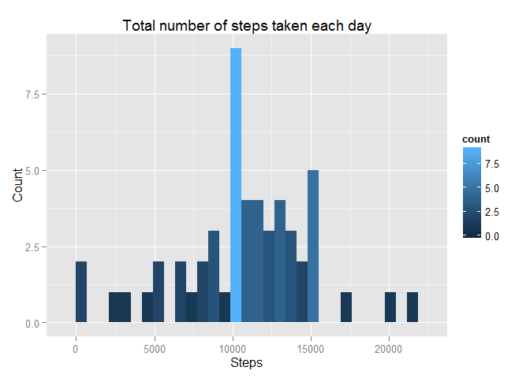
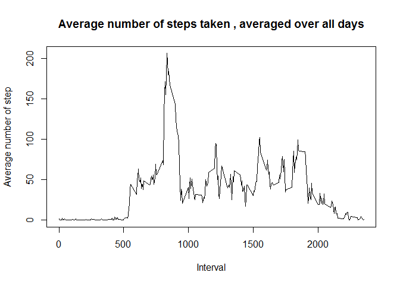
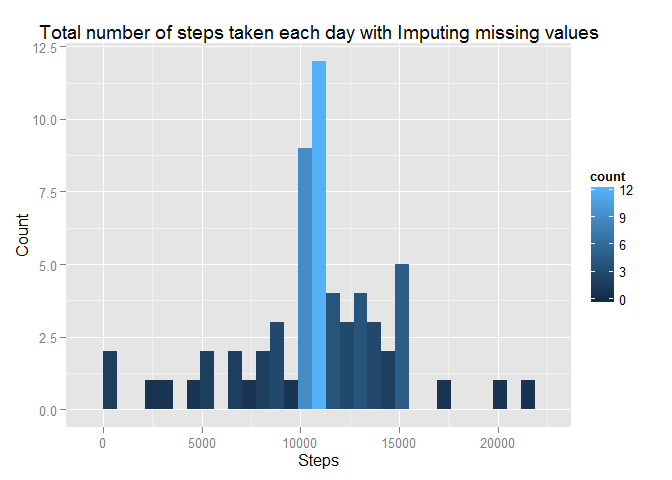

# Reproducible Research: Peer Assessment 1

## Loading and preprocessing the data

```r
library("knitr")
opts_chunk$set(echo=TRUE , warning=FALSE, message=FALSE)
setwd("E:/myGitFolder/m5_Coursera/RepData_PeerAssessment1")
activity <- read.csv(file = 'activity.csv' , sep = ',')
```
## What is mean total number of steps taken per day?
1. Calculate the total number of steps taken per day


```r
activityWithoutNA <- subset(x = activity, !is.na(activity$steps))
totalNoOfStepsByDate <- aggregate(steps~ date , data =  activityWithoutNA, FUN = sum)
```
Summary : 

```r
head(totalNoOfStepsByDate)
```

```
##         date steps
## 1 2012-10-02   126
## 2 2012-10-03 11352
## 3 2012-10-04 12116
## 4 2012-10-05 13294
## 5 2012-10-06 15420
## 6 2012-10-07 11015
```
2. Make a histogram of the total number of steps taken each day


```r
library(ggplot2)
ggplot(totalNoOfStepsByDate, aes(steps)) + geom_histogram(aes(fill = ..count..)) + labs(title= 'Total number of steps taken each day' , x = 'Steps' , y = "Count" ) 
```

 

3. Calculate and report the mean and median of the total number of steps taken per day


```r
meanTotalStep <-  mean(totalNoOfStepsByDate$steps, na.rm = T)
medianTotalStep <- median(totalNoOfStepsByDate$steps, na.rm = T)
```

*Mean of the total number of steps taken per day : 1.0766189\times 10^{4}*

*Median of the total number of steps taken per day : 10765*

## What is the average daily activity pattern?
1. Make a time series plot (i.e. type = "l") of the 5-minute interval (x-axis) and the average number of steps taken, averaged across all days (y-axis)


```r
avgIntervalStep <- aggregate( steps ~ interval , data = activityWithoutNA, FUN = mean)

plot(avgIntervalStep$interval , avgIntervalStep$steps , type = 'l', 
main="Average number of steps taken , averaged over all days", xlab="Interval", 
ylab="Average number of step")
```

 

2. Which 5-minute interval, on average across all the days in the dataset, contains the maximum number of steps?


```r
maxInterval <- avgIntervalStep[ which.max(avgIntervalStep$steps),]
```
*Interval 835 contains the maximum number of steps*

## Imputing missing values

1. Calculate and report the total number of missing values in the dataset
Total number of missing values in the dataset : 2304

2. Devise a strategy for filling in all of the missing values in the dataset. The strategy does not need to be sophisticated. For example, you could use the mean/median for that day, or the mean for that 5-minute interval, etc.

Answer --> 
Uses mean steps value store in "avgIntervalStep" to replace the NA steps in dataset based on the interval value

3. Create a new dataset that is equal to the original dataset but with the missing data filled in.

```r
newActivity <- activity
for( i in 1:nrow(newActivity))
{
    if(is.na(newActivity$steps[i])){
      newActivity$steps[i] <- 
        avgIntervalStep[which(avgIntervalStep$interval == newActivity$interval),]$steps
    }
}
```

4. Make a histogram of the total number of steps taken each day and Calculate and report the mean and median total number of steps taken per day. Do these values differ from the estimates from the first part of the assignment? What is the impact of imputing missing data on the estimates of the total daily number of steps?


```r
totalNoOfStepsByDateForNewActivity <- aggregate(steps~ date , data =  newActivity, FUN = sum)

ggplot(totalNoOfStepsByDateForNewActivity, aes(steps)) + geom_histogram(aes(fill = ..count..)) + labs(title= 'Total number of steps taken each day version 2' , x = 'Steps' , y = "Count" ) 
```

 
Answer : 
Yes , it's different from first part.
## Are there differences in activity patterns between weekdays and weekends?
